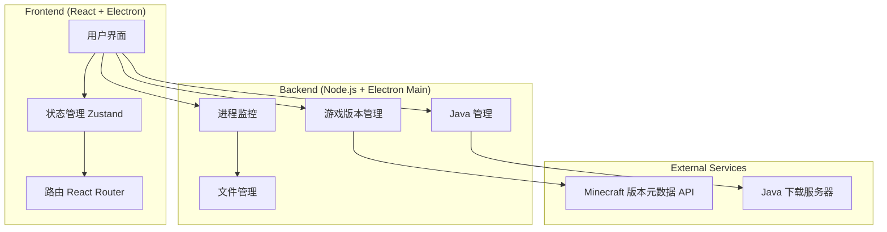

## 1. Architecture Design


## 2. Technology Description
- **Frontend**: React@18 + TypeScript + Tailwind CSS + Vite + Electron
- **State Management**: Zustand
- **Routing**: React Router DOM
- **Icons**: Lucide React
- **Backend**: Electron Main Process + Node.js
- **File Storage**: Local file system

## 3. Route Definitions
| Route | Purpose |
|-------|---------|
| / | 主页 - 游戏版本列表 |
| /java | Java 管理页面 |
| /settings | 后台管理设置页面 |

## 4. Data Model
### 4.1 Type Definitions
```typescript
// 游戏版本类型
interface GameVersion {
  id: string;
  type: 'release' | 'snapshot' | 'old_alpha' | 'old_beta';
  url: string;
  time: string;
  releaseTime: string;
  installed?: boolean;
  forgeVersion?: string;
  neoForgeVersion?: string;
  launchCount: number;
}

// Java 版本类型
interface JavaVersion {
  id: string;
  version: '8' | '11' | '17' | '21' | '25' | '26';
  path?: string;
  installed: boolean;
  downloadUrl: string;
}

// 游戏设置类型
interface GameSettings {
  memory: {
    min: number;
    max: number;
  };
  versionIsolation: boolean;
  selectedJava: string;
  javaArgs: string;
}

// 性能监控数据
interface PerformanceData {
  cpu: number;
  ram: number;
  gpu: number;
  diskRead: number;
  diskWrite: number;
}
```

## 5. File Structure
```
/workspace
├── src/
│   ├── components/
│   │   ├── GameVersionCard.tsx
│   │   ├── JavaVersionCard.tsx
│   │   ├── PerformanceMonitor.tsx
│   │   └── ProgressBar.tsx
│   ├── pages/
│   │   ├── Home.tsx
│   │   ├── JavaManager.tsx
│   │   └── Settings.tsx
│   ├── hooks/
│   │   ├── useGameVersions.ts
│   │   ├── useJavaVersions.ts
│   │   └── usePerformanceMonitor.ts
│   ├── utils/
│   │   ├── downloader.ts
│   │   ├── javaFinder.ts
│   │   └── gameLauncher.ts
│   ├── store/
│   │   └── useAppStore.ts
│   ├── App.tsx
│   └── main.tsx
├── electron/
│   ├── main.ts
│   └── preload.ts
├── package.json
├── tsconfig.json
└── vite.config.ts
```
