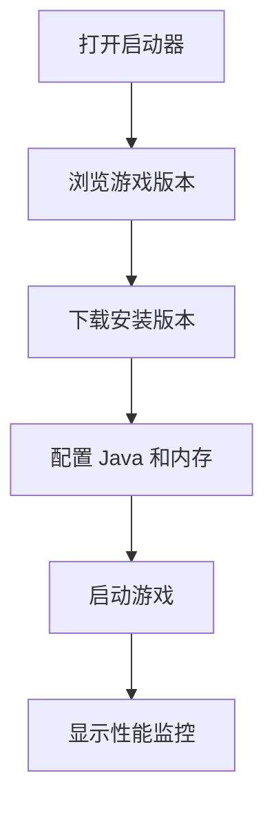

## 1. Product Overview
一个现代化的 Minecraft 启动器，提供游戏版本管理、Java 环境管理、游戏启动和性能监控功能。
- 主要功能包括游戏版本下载安装、Java 环境自动管理、游戏性能实时监控、游戏后台设置管理
- 目标用户为 Minecraft 玩家，解决启动器使用复杂、版本管理困难等问题

## 2. Core Features

### 2.1 Feature Module
1. **主页**: 游戏版本列表、下载安装、启动游戏
2. **Java 管理**: Java 版本下载安装、自动查找、自动选择
3. **性能监控**: 游戏进程 CPU、RAM、GPU、硬盘读写监控
4. **后台管理**: 内存限制、版本隔离、Java 选择、启动统计

### 2.3 Page Details
| Page Name | Module Name | Feature description |
|-----------|-------------|---------------------|
| 主页 | 游戏版本列表 | 显示可下载和已安装的 Minecraft 版本 |
| 主页 | 版本下载安装 | 下载并安装 Minecraft 游戏版本 |
| 主页 | 启动游戏 | 启动选中的 Minecraft 游戏版本 |
| Java 管理 | Java 下载 | 下载指定版本的 Java（8/11/17/21/25/26） |
| Java 管理 | Java 安装 | 安装已下载的 Java 并显示进度条 |
| Java 管理 | Java 自动查找 | 扫描系统已安装的 Java 版本 |
| Java 管理 | Java 自动选择 | 根据游戏版本自动选择合适的 Java |
| 性能监控 | 进程监控 | 显示游戏进程的 CPU、RAM、GPU 使用率 |
| 性能监控 | 硬盘监控 | 显示游戏目录的读写速度 |
| 后台管理 | 内存限制 | 设置游戏可使用的最大内存 |
| 后台管理 | 版本隔离 | 开启/关闭版本隔离功能 |
| 后台管理 | Java 选择 | 手动选择游戏使用的 Java 版本 |
| 后台管理 | 启动统计 | 查看游戏启动次数和版本信息 |

## 3. Core Process
用户打开启动器 → 选择游戏版本 → 配置 Java 和内存 → 启动游戏 → 实时监控游戏性能

## 4. User Interface Design
### 4.1 Design Style
- 主色调：深蓝色 #1e3a8a，辅助色：亮蓝色 #3b82f6
- 按钮风格：圆角矩形，带有渐变效果
- 字体：Inter 字体族，清晰易读
- 布局风格：卡片式布局，导航栏 + 内容区
- 图标：使用 Lucide React 图标库

### 4.2 Page Design Overview
| Page Name | Module Name | UI Elements |
|-----------|-------------|-------------|
| 主页 | 游戏版本列表 | 卡片列表，显示版本信息、状态、操作按钮 |
| Java 管理 | Java 版本 | 进度条显示下载/安装进度，状态指示器 |
| 性能监控 | 监控面板 | 右下角弹出式面板，实时更新图表 |
| 后台管理 | 设置表单 | 滑块、开关、下拉选择等表单控件 |

### 4.3 Responsiveness
桌面端优先，适配 1280x720 及以上分辨率
